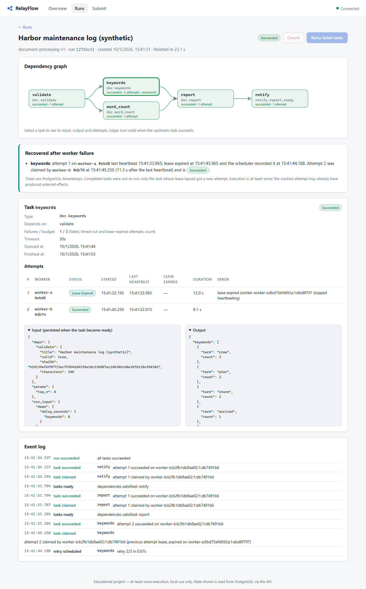

# RelayFlow

RelayFlow is a small durable workflow engine written in Python. It runs workflows
(directed acyclic graphs of tasks), saves every step in PostgreSQL, and recovers
unfinished work when a worker process crashes. A React dashboard shows the state
stored in the database: task graphs, attempts, leases, retries and recoveries.

It is an educational portfolio project, **not production software**. There is no
authentication, it is meant for local use only, and execution is
**at-least-once**, not exactly-once.



## What it does

- **Versioned workflow definitions.** A definition is a DAG of *registered* task types,
  validated on registration: cycles, missing dependencies and unsupported types are
  rejected. Arbitrary code or shell commands are never accepted. Each run keeps an
  immutable snapshot of its definition.
- **Multiple independent worker processes.** Workers claim tasks atomically with
  `SELECT … FOR NO KEY UPDATE SKIP LOCKED` and hold **leases** that they renew with
  heartbeats. Each attempt has a unique ownership token. Lease decisions use
  PostgreSQL's clock.
- **Recovery.** A separate scheduler process expires lapsed leases and re-queues the
  task, so another worker continues. A stale worker's late heartbeat or completion is
  rejected.
- **Retries and limits.** Retries are bounded, with exponential backoff and jitter.
  Timeouts are cooperative, with a scheduler backstop. Each worker has a fixed number
  of slots (bounded concurrency), and shutdown is graceful.
- **Run control.** Cooperative cancellation, with defined races. Manual retry of
  failed runs keeps successful outputs and the full attempt history.
- **Idempotent submission.** The same key and payload return the same run; a
  different payload under the same key returns 409. A unique constraint enforces this.
- **Database-enforced invariants.** Constraints, a partial unique index (at most one
  running attempt per task) and immutability triggers enforce the rules, not only
  Python checks.
- **A demonstration workflow.** Validate a synthetic document → word count ∥
  keywords → report → notify a separate **mock notification service** that
  deduplicates by a stable `run_id:task_key` idempotency key.

## Architecture

```
 browser ──▶ dashboard (nginx + React) ──/api──▶ api (FastAPI)  ─┐
                                                                 │ short SQL transactions
 worker-a ─┐                                                     ▼
 worker-b ─┼──────── claim / heartbeat / report ─────────▶  PostgreSQL 17
 scheduler ┘ (lease expiry, timeout backstop)                    ▲
     └─ notify task ──HTTP + Idempotency-Key──▶ mocknotify ──────┘ (own database)
```

The API only records intent and reads state; it never runs tasks. PostgreSQL is the
only coordination mechanism: there is no message broker, no in-memory queue, and no
shared files. Python uses synchronous SQLAlchemy Core with psycopg 3, and each
operation runs one short transaction on its own pooled connection. No transaction is
open while a task runs. The spec, with every state transition, is in
[docs/architecture.md](docs/architecture.md).

## Quick start (Windows PowerShell)

You need Docker Desktop. For tests and scripts you also need
[uv](https://docs.astral.sh/uv/) (Python 3.13) and Node 24.

```powershell
git clone https://github.com/rosaiju/relayflow.git
cd relayflow
docker compose up -d --build        # postgres, api, 2 workers, scheduler, mocknotify, dashboard
```

Open **http://127.0.0.1:8080**. All ports bind to localhost only: dashboard 8080,
API 8000 (docs at http://127.0.0.1:8000/docs), mock service 8100, PostgreSQL 5433.

To enable the fault-injection options used by the demos (local only, off by default):

```powershell
$env:RELAYFLOW_ENABLE_FAULT_INJECTION = "1"; docker compose up -d --build
Remove-Item Env:RELAYFLOW_ENABLE_FAULT_INJECTION   # afterwards
```

Stop the stack with `docker compose stop`. `docker compose down -v` also **deletes the
database volume**.

## Demos

| What | Command |
|---|---|
| Automated crash-recovery demo with assertions (kills a worker mid-task, crashes a worker after the notification is sent, restarts PostgreSQL mid-run, restarts every service keeping the volume) | `uv sync; uv run python scripts/demo_recovery.py` |
| Five-minute guided browser demo | [docs/browser-demo.md](docs/browser-demo.md) |
| Benchmarks (throughput, dispatch latency, crash recovery) | `uv run python scripts/bench.py` → [BENCHMARKS.md](BENCHMARKS.md) |

## Tests

```powershell
uv sync
uv run pytest -m "not integration"     # unit tests, no database
uv run pytest                          # everything: needs the compose postgres on 127.0.0.1:5433
uv run ruff format --check . ; uv run ruff check . ; uv run mypy
cd frontend; npm ci; npm run typecheck; npm run build
npx playwright install chromium; npx playwright test   # needs the stack running with fault injection
```

Integration tests use real PostgreSQL, never SQLite. `tests/correctness/` was written
by an independent test agent working from the specification. It covers competing
claims, lock-ordering interleavings, stale ownership, subprocess crashes,
notification crashes after the effect, and connection termination. It found a real
claim/cancel deadlock, which is now fixed (see [docs/spec-review.md](docs/spec-review.md)).
[docs/correctness.md](docs/correctness.md) maps every guarantee to its tests.

## Limitations (deliberate or known)

- **At-least-once, not exactly-once.** A task can run twice: after a crash between
  its effect and the acknowledgement, or after a slow worker loses its lease. Tokens
  protect RelayFlow's own tables, but they cannot stop a stale process from calling
  an external service. Duplicate *logical* effects are avoided only when the receiver
  implements idempotency, as the mock service does.
- Timeouts and cancellation are cooperative, because Python threads cannot be killed.
  A handler that ignores its context keeps its worker slot until it returns, and the
  scheduler's timeout backstop re-queues the task.
- Workers poll for new tasks (0.5 s by default) instead of using LISTEN/NOTIFY.
  Throughput is limited by PostgreSQL transactions; see the measured numbers in
  [BENCHMARKS.md](BENCHMARKS.md).
- No authentication, authorization or multi-tenancy. It runs on localhost only and is
  not hardened for hosting. Inputs are bounded (64 KiB run input, 20 000-character
  documents).
- Python has no race detector comparable to Go's `-race`. Concurrency is checked with
  multi-thread and multi-process tests, deterministic lock interleavings and SQL
  invariant checks, which is strong evidence but not proof.
- It has only been verified on the environments listed in [STATUS.md](STATUS.md).

## Documentation

[Architecture & spec](docs/architecture.md) · [Correctness map](docs/correctness.md) ·
[Spec review](docs/spec-review.md) · [Learning guide](docs/learning-guide.md) ·
[Interview guide](docs/interview-guide.md) · [Benchmarks](BENCHMARKS.md) · [Status](STATUS.md)

## Credits

The design draws on well-known public patterns rather than on any copied code:
PostgreSQL's documentation on `SELECT … FOR UPDATE SKIP LOCKED` and row-level lock
modes, the queue-in-Postgres approach popularized by projects like Que and
graphile-worker, lease/fencing-token ideas from Martin Kleppmann's *Designing
Data-Intensive Applications*, and the "equal jitter" backoff from the AWS
Architecture Blog post "Exponential Backoff and Jitter". No code was borrowed from
those projects. Libraries: FastAPI, SQLAlchemy, Alembic, psycopg, Pydantic, httpx,
React, React Router, Vite and Playwright.
